# College Event Ticketing Platform

## ✨ Introduction
The **College Event Ticketing Platform** is a fun and easy-to-use website for students and event organizers. It helps people create and manage events, buy tickets securely, and keep track of their bookings. With a colorful, responsive design, it looks great on all devices. Features like QR code tickets, user profiles, and a smooth checkout process make it simple for everyone to join in and enjoy college events.

### What It Does
The **College Event Ticketing Platform** is a complete solution for students and event organizers to manage, discover, and purchase tickets for college events. This platform offers an intuitive user experience with a seamless ticket booking process and provides QR code-based tickets for easy entry.

### Why You'll Love It
- **User-Friendly**: An attractive, responsive design built with Bootstrap that adapts perfectly on all devices.
- **Secure Payments**: Integration with Stripe for easy and secure ticket purchases.
- **Convenient Ticket Management**: Users receive email confirmations with QR codes for purchased tickets.
- **Comprehensive Profile Management**: Keep track of created events and purchased tickets in one place.

### Who It's For
- **Event Organizers**: Create and manage events, track ticket sales, and edit event details.
- **Students**: Discover upcoming events, purchase tickets easily, and keep track of bookings.

## 🎨 Style
The platform features a vibrant, modern color scheme aimed at a teenage and college student audience. The primary colors include shades of blue, green, and purple, with colorful gradient buttons to create an engaging and lively experience.

### Primary Buttons on the First Screen
The first screen button styled with warm colors to catch the user's attention:

Red (#ff6b6b) 🍎 – Yellow (#ffcc33) 🌟 – Green (#4caf50) 🍃 


### Gradient Buttons for Event List on Home Page
The event list on the home page comes to life with **gradient buttons that are randomly styled** from a curated palette of vibrant gradients. This dynamic approach ensures that each user interaction feels fresh and unique.

The buttons are randomly assigned one of the following gradients:
- Gradient 1: linear-gradient(45deg, #ff6b6b, #ffcc33) – A bold and energetic blend of red and gold.
- Gradient 2: linear-gradient(45deg, #36d1dc, #5b86e5) – A cool and calming transition of aqua and blue.
- Gradient 3: linear-gradient(45deg, #ff758c, #ff7eb3) – A playful and vibrant pink-to-rose gradient.
- Gradient 4: linear-gradient(45deg, #667eea, #764ba2) – A deep and mysterious purple fade.
- Gradient 5: linear-gradient(45deg, #f7971e, #ffd200) – A warm and cheerful golden orange glow.
- Gradient 6: linear-gradient(45deg, #30cfd0, #330867) – A striking contrast of teal and navy.
- Gradient 7: linear-gradient(45deg, #43cea2, #185a9d) – A fresh and natural green-to-blue gradient.
  


### Gradient Buttons for Event List Page
Each button on the Event List Page is **assigned a gradient at random** from the palette, making the interface dynamic and visually diverse. This playful use of colors adds variety and excitement for users browsing events.

Gradient Options: 
- Gradient 1: linear-gradient(to right, #ff6f61, #ff9472) – A warm peach-to-coral gradient for a soft and inviting look.
- Gradient 2: linear-gradient(to right, #6b5b95, #b8a9c9) – A sophisticated transition from deep purple to lavender.
- Gradient 3: linear-gradient(to right, #88b04b, #d0e17d) – A lively green gradient that feels fresh and organic.
- Gradient 4: linear-gradient(to right, #f7cac9, #f3a683) – A gentle pink-to-peach blend for a delicate touch.
- Gradient 5: linear-gradient(to right, #92a8d1, #34ace0) – A crisp blue gradient, evoking calm and clarity.
- Gradient 6: linear-gradient(to right, #ffb347, #ffcc33) – A cheerful gold-to-yellow transition for a bright and optimistic feel.
- Gradient 7: linear-gradient(to right, #d4a5a5, #ff8c94) – A soft pink gradient with hints of warmth and energy.
- Gradient 8: linear-gradient(to right, #b565a7, #8e44ad) – A rich purple gradient that’s bold and captivating.
- Gradient 9: linear-gradient(to right, #009688, #48c9b0) – A teal-to-mint gradient that feels refreshing and modern.
- Gradient 10: linear-gradient(to right, #ff8c00, #ff6347) – A fiery orange-to-red gradient for a bold and striking appearance.


### Footer
The footer is styled with a sleek and minimalistic design to provide contrast and focus:

Color: #1a1a1a 🖤 – A deep, dark shade that ensures readability and draws attention to footer content without distraction.


### Styling Framework
Been used [Bootstrap](https://getbootstrap.com/) for a consistent, responsive layout across all devices. Custom CSS has been added for unique elements like gradient buttons, a fixed footer, and a styled navbar.

## 🚀 Features
This project comes with features thoughtfully crafted for college students. Everything is designed to make exploring events, managing tickets, and staying updated easy and enjoyable.

### 🏠 Home Page
The home page is designed with a vibrant, student-friendly style that immediately grabs attention and sets the tone for the platform. Here’s what it offers:

- **Colorful Banner Image**: A large, dynamic image at the top of the page creates an energetic and welcoming vibe, perfect for a student audience.
- **Upcoming Events Preview**: The 6 soonest events are displayed in an easy-to-scan card layout, each showing key details like title, date, and a short description.
- **Call-to-Action Button**: A bold gradient-styled button stands out, encouraging users to explore all events and discover more.
- **Responsive Design**: The layout adapts fluidly to various screen sizes, ensuring a smooth experience on any device.

|Screenshot |  Wireframe |
|--|--|
|    |  |


### 🗓️ Upcoming Events Page
The Upcoming Events page provides a comprehensive list of all future events in an organized and visually engaging layout. It’s designed to help users easily discover and explore events that interest them. Here's what it includes:

- **Event Cards**: Events are presented in vertically aligned cards, each showcasing an image, title, date, description, and a “View Details” button. To keep the design lively, the "View Details" buttons have randomly assigned colors, adding a fun and dynamic touch to the page.
- **Filter by Category**: Users can narrow down their search by selecting specific categories like Music, Sports, Education, and more.
- **Search Functionality**: A search bar allows users to find events by typing in relevant keywords.
- **Adaptive Layout**: Built with Bootstrap’s responsive grid system, the page looks great and works seamlessly across all device types.

|Screenshot |  Wireframe |
|--|--|
|   | |


### 📅 Event Detail Page
The Event Detail page gives users all the important information about a specific event in one place, presented in a simple and visually appealing way.

- **Large Banner Image**: A striking banner image at the top sets the tone for the event, with the event title overlay adding a professional and polished touch.
- **Details Section**: This section provides all the key information about the event, including:
    - Date and Time
    - Venue
    - Description
    - Ticket Price
- **Ticket Availability**: Users can see real-time updates on the number of tickets remaining. If the event is sold out, a bold red "SOLD OUT" message is prominently displayed, ensuring clarity.
- **Purchase Button**: A vibrant gradient button lets users easily purchase tickets or book a spot for free events.

|Screenshot |  Wireframe |
|--|--|
|   | |


### 🛒 Ticket Purchase Page
The Ticket Purchase page features a sleek, user-friendly form for selecting ticket quantity and completing the payment process using Stripe.

- **Dynamic Quantity Selector**: Users can adjust the number of tickets, and the total price updates automatically.
- **Billing Details Form**: Pre-filled with the logged-in user’s name and email for convenience.
- **Stripe Integration**: A secure Stripe form allows users to enter their payment details.
- **Responsive Design**: The form adapts well to different screen sizes for a consistent experience.
- **Payment Confirmation**: Upon successful payment, users are redirected to a success page.

|Screenshot |  Wireframe |
|--|--|
|   | |
|  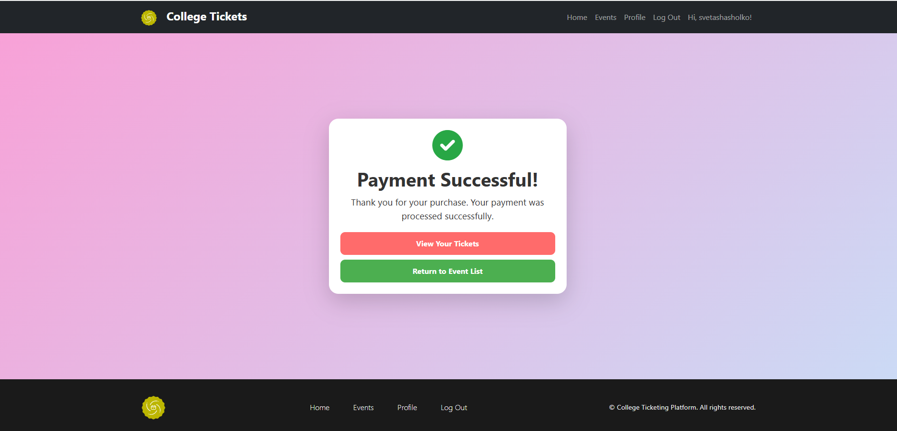 ||


### 👤 Profile Page
The Profile page provides a personalized experience, displaying user information and an overview of the user’s activities on the platform. It includes two main sections: Created Events and Purchased Tickets.

#### Created Events Block
Organizers can view their created events with options to edit, delete, or view detailed stats about each event.

- **Upcoming Events**: Displays a list of upcoming events created by the user. Includes an "Edit" and "Delete" button for each event.
- **Past Events**: Lists past events with ticket sales stats.
- **Add New Event Button**: A colorful button allows users to quickly add a new event.

#### Purchased Tickets Block
Displays all the tickets purchased by the user with key details such as event title, date, time, quantity, and a QR code for ticket validation.

- **Event Details**: Lists the event title, date, and ticket quantity.
- **QR Code Display**: Shows a QR code for each purchased ticket, which can be clicked to view in full size.
- **Adaptive Layout**: Uses a two-column layout on larger screens for a clear and organized view.

|Screenshot |  Wireframe |
|--|--|
|   | |
|  | |
|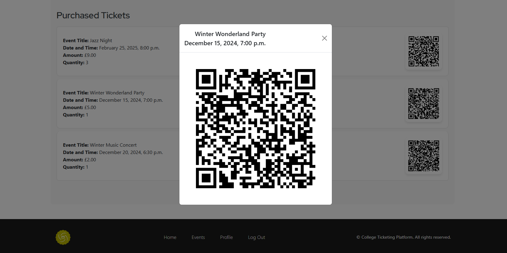 |


### ✏️ Add / Edit / Delete Event Pages
These pages allow users to manage events easily through intuitive forms styled in line with the rest of the platform.

- **Add Event**: A form to input event details like title, date, venue, description, ticket price, and an image upload option.
- **Edit Event**: Pre-populated with the current event details, making it easy for users to update any information.
- **Delete Event**: A confirmation page to prevent accidental deletions with a notification message upon successful deletion.

|Screenshot |  Wireframe |
|--|--|
|Add event| |
|   | |
|Edit event| |
|   | |
|Delete event| |
|   | |


### 🔑 Authentication Pages (Sign Up, Log In, Log Out)
Custom-styled authentication pages that are both functional and visually appealing.

- **Google Login Integration**: Allows users to quickly log in using their Google account.
- **Custom Form Styling**: Forms are styled consistently with the platform’s modern look and feel.
- **User Feedback**: Clear messages for successful login, logout, and registration.

|Screenshot |  Wireframe |
|--|--|
|Sign Up |
|  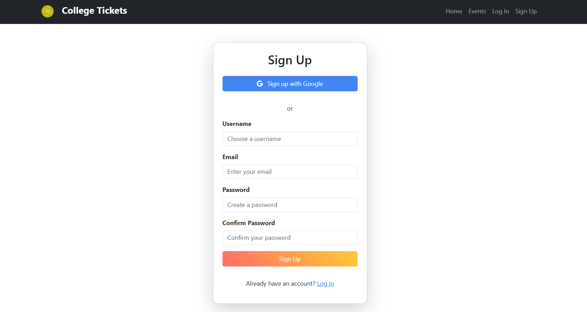 | 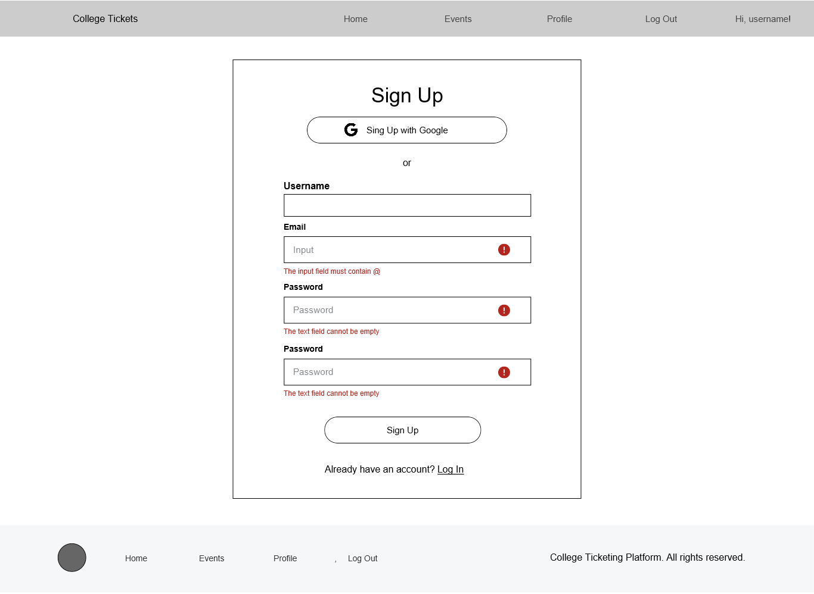|
|Log In |
|  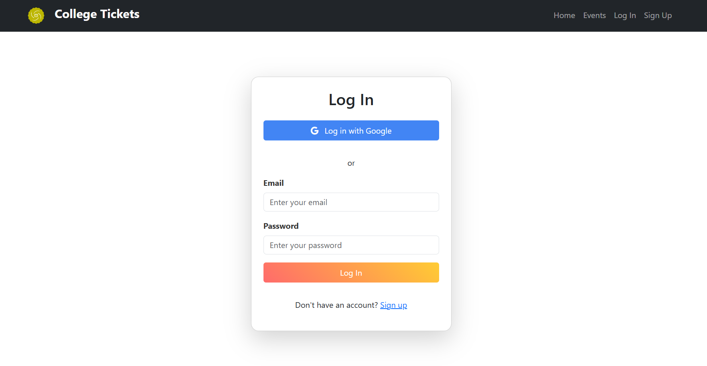 | 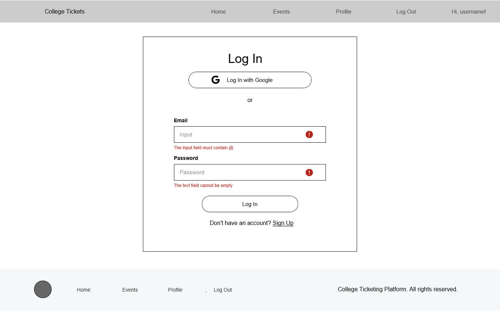|
|Log Out |
|  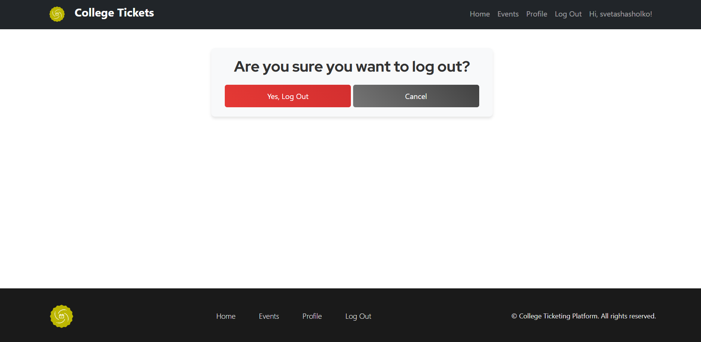 | 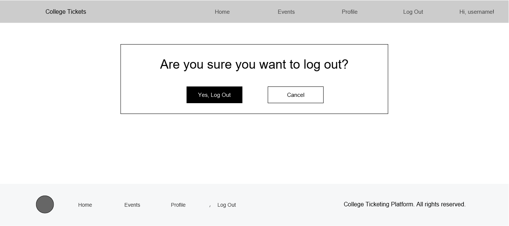 |


### Email with QR Code
After purchasing a ticket, users receive an email confirmation with the event details and a QR code for easy entry validation.

- **Custom Email Template**: Styled email with the platform’s branding and event details.
- **QR Code Attachment**: The email includes the QR code as an attachment, making it easy for users to present it at the event entrance.
- **Responsive Email Design**: Ensures that the email looks good on both desktop and mobile devices.

|Custom Email Template |  QR Code Attachment |
|--|--|
| 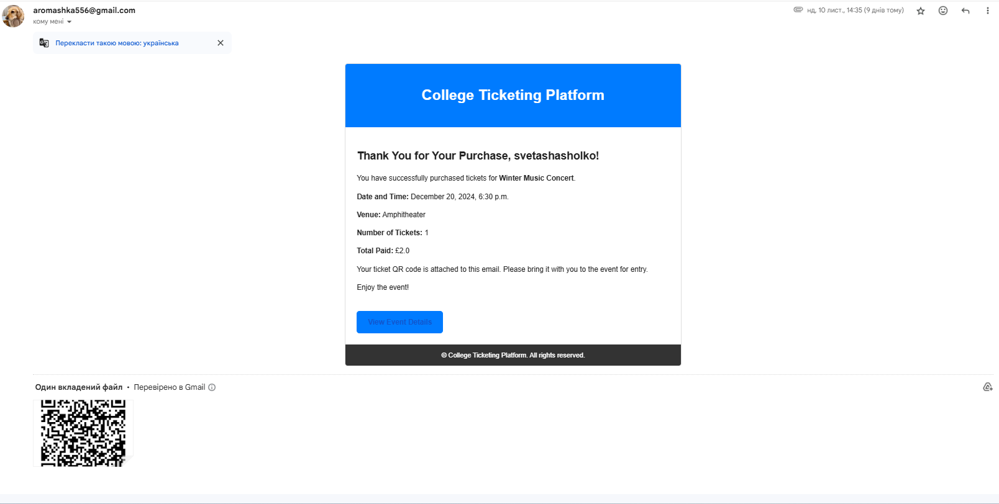 | 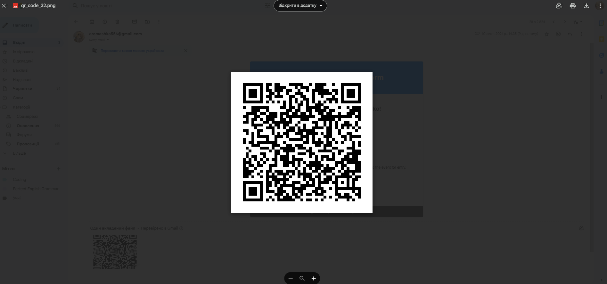|


## 🗂️ Database Schema
Below is the schema for the platform, showcasing the relationships between different models.

 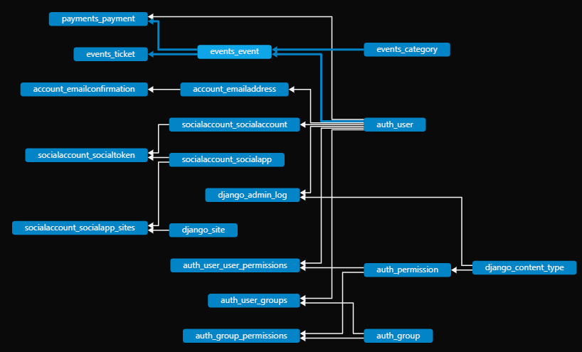


## 🛠️ Technologies Used
This project leverages modern web development tools and technologies to ensure a seamless and efficient experience for users. Here's a breakdown of the key technologies used:

### **Frontend**
- **HTML5 & CSS3**: Structure and styling of web pages.
- [Bootstrap](https://getbootstrap.com/): Ensures responsive design for all devices and modern UI components.
- **JavaScript**: For interactivity, such as dynamic buttons colour update.
- [Flatpickr](https://flatpickr.js.org/): A lightweight library for modern, user-friendly date pickers.

### **Backend**
- [Python](https://www.python.org/): Core programming language for backend logic.
- [Django](https://www.djangoproject.com/): A powerful framework for building secure and scalable web applications.
- **Django-Allauth**: Handles user authentication and social logins (e.g., Google).

### **Payment Integration**
- [Stripe API](https://stripe.com/): Secure online payment processing for ticket purchases.

### **QR Code Generation**
- [qrcode Library](https://pypi.org/project/qrcode/): Generates QR codes for tickets, enhancing event entry management.

### **Email Functionality**
- **Django Email Backend**: Sends transactional emails, including ticket confirmations with QR codes.

### **Deployment**
- [Heroku](https://www.heroku.com/): Cloud platform for deploying the project with GitHub integration.
- [Gunicorn](https://gunicorn.org/): WSGI HTTP server for running the application in production.

### **Cloud Storage**
- [Cloudinary](https://cloudinary.com/): For media file management and QR code storage.

### **Version Control**
- [Git & GitHub](https://github.com/): For version control and project hosting.

### **Other Tools**
- [Font Awesome](https://fontawesome.com/): For attractive icons on the website.
- [Pillow](https://github.com/CSFelix/PYTHON-PILLOW-PYQRCODE-QR-CODE-GENERATOR): For image processing and QR code handling.
- [Google Fonts](https://fonts.google.com/): Integrated for access to a diverse selection of web fonts to enhance typography.
- [Justinmind](https://www.justinmind.com/): Utilized for visual planning and wireframing.


## 🧪 Manual Testing
The application has been tested to ensure that it functions as expected. Below is a list of test cases performed, grouped by feature. Each test was carried out manually on multiple devices (desktop, tablet, and mobile) and across different browsers (Chrome, Firefox, Safari, and Edge).


### 1. Home Page Tests
|Test Case |  Steps | Expected Result |  Status |
|--|--|--|--|
| Home Page Load |	Open the home page in the browser	 | The home page should load without any errors, displaying the header, event cards, and call-to-action button	|✅ Pass|
| Responsive Layout	| Resize the browser window and check on different devices	| The layout should adjust smoothly without overlapping content | ✅ Pass | 
|Call-to-Action Button |	Click the "See All Events" button|	User should be redirected to the event list page|	✅ Pass|


### 2. Event List Page Tests
|Test Case |  Steps | Expected Result |  Status |
|--|--|--|--|
|Event Filtering|	Select a category from the dropdown and click search|	Only events matching the selected category should be displayed|	✅ Pass|
|Event Search	|Enter a keyword in the search bar and click search|	The list should update to show relevant events	|✅ Pass|
|Clear Search|	Click the "Clear Search" button|	The search bar and category filter should reset, displaying all events	|✅ Pass|
|Event Card Display	|Check the appearance of event cards	|All event images should be the same size and not distorted	|✅ Pass|
|Responsive Design	|Check the layout on mobile and tablet devices	|The layout should be vertical and adjust appropriately	|✅ Pass|


### 3. Event Detail Page Tests
|Test Case |  Steps | Expected Result |  Status |
|--|--|--|--|
|Event Details Load	|Click on an event from the event list	|The Event Detail page should load with complete information (title, image, date, venue, description)|	✅ Pass|
|Ticket Availability Check|	Check the "Tickets Remaining" text	|The number of tickets should update based on purchases; if sold out, it should display "SOLD OUT"	|✅ Pass|
|Purchase Button Visibility	|Check the visibility of the "Purchase Tickets" button	|The button should be visible if tickets are available; hidden if sold out|	✅ Pass|
|Responsive Design	|Resize the browser and test on mobile devices	|The title overlay and layout should adjust correctly	|✅ Pass|


### 4. Ticket Purchase Page Tests
|Test Case |  Steps | Expected Result |  Status |
|--|--|--|--|
|Quantity Input Validation	|Enter a negative number or zero for the quantity	|The form should show an error message: "Quantity must be at least 1"	| ✅ Pass|
|Dynamic Total Price Calculation|	Change the quantity of tickets|	The total price should update automatically	|✅ Pass|
|Stripe Payment Form|	Enter valid and invalid card details|	Payment should only proceed with valid card details; invalid details should show an error message	|✅ Pass|
|Successful Payment Flow	|Enter valid payment details and click "Purchase Ticket"	|User should be redirected to the success page, and a confirmation email should be sent	|✅ Pass|


### 5. Profile Page Tests
|Test Case |  Steps | Expected Result |  Status |
|--|--|--|--|
|View Created Events|	Navigate to the Profile page	|The "Created Events" section should display all events created by the user|✅ Pass|
|Edit and Delete Event Buttons|	Click "Edit" or "Delete" for an event	|User should be redirected to the respective page and see a confirmation message upon deletion	|✅ Pass|
|Purchased Tickets Section|	Check the "Purchased Tickets" section	|It should list all purchased tickets with event details and QR code	|✅ Pass|
|QR Code Click	|Click on the QR code image|	The QR code should open in full size	|✅ Pass|


### 6. Add / Edit / Delete Event Tests
|Test Case |  Steps | Expected Result |  Status |
|--|--|--|--|
|Add Event Form Validation	|Submit the form with missing required fields|	Form should display validation errors for missing fields|	✅ Pass|
|Edit Event Form Pre-fill|	Open an existing event for editing|	The form should be pre-filled with the current event details|	✅ Pass|
|Delete Event Confirmation	|Click "Delete" and confirm|	The event should be deleted, and a success message should appear|	✅ Pass|


### 7. Authentication Tests (Sign Up, Log In, Log Out)
|Test Case |  Steps | Expected Result |  Status |
|--|--|--|--|
|Sign Up Form Validation	| Try signing up without filling all fields|	Form should display validation errors|	✅ Pass|
|Google Login Integration|	Click "Log in with Google"|	User should be redirected to Google’s login page and back to the app after login|	✅ Pass|
|Logout Flow|	Click "Log Out"	| User should see a confirmation page and be redirected to the home page upon logout	|✅ Pass|


### 8. Email Notifications
|Test Case |  Steps | Expected Result |  Status |
|--|--|--|--|
|Email Receipt for Ticket Purchase	|Complete a ticket purchase	|User should receive an email with event details and QR code attached|	✅ Pass|
|Responsive Email Design	|Open the email on different devices|	The email layout should adjust properly on both desktop and mobile|	✅ Pass|


### 9. Error Handling and Edge Cases
|Test Case |  Steps | Expected Result |  Status |
|--|--|--|--|
|404 Page Not Found|	Access a non-existent URL	|The custom 404 error page should appear with a helpful message and navigation options	|✅ Pass|

### 10. Cross-Browser Compatibility
|Browser	|Tested Features	|Status|
|--|--|--|
|Google Chrome	|Full application	|✅ Pass|
|Mozilla Firefox	|Full application	|✅ Pass|
|Microsoft Edge|	Full application|	✅ Pass|
|Safari|	Full application	|✅ Pass|

### Lighthouse Performance Scores
Been used Google Lighthouse to audit the website's performance, accessibility, SEO, and best practices. Below are the Lighthouse scores for key pages in the application:

|Page	|Performance	|Accessibility| Best Practices| SEO| 
|--|--|--|--|--|
|Home Page|73|85|61|91|
|Event List Page|70|84|61|91|
|Event Detail Page|72|88|61|91|
|Profile Page|90|78|61|91|
|Ticket Purchase Page|91|87|79|91|


## 🌐 Deployment
The College Event Ticketing Platform is deployed on Heroku with Cloudinary managing media files like event images and QR codes.

Steps to Deploy Directly to Heroku:

### Prepare the Project
1. Ensure `requirements.txt`, `Procfile`, and `.env` are correctly configured.
2. Add Cloudinary settings to `settings.py`:
```python
DEFAULT_FILE_STORAGE = 'cloudinary_storage.storage.MediaCloudinaryStorage'
```
3. Set environment variables in Heroku:
- `SECRET_KEY`
- `CLOUDINARY_URL`
- Stripe keys: `STRIPE_PUBLIC_KEY`, `STRIPE_SECRET_KEY`, `STRIPE_WEBHOOK_SECRET`.

### Deploy to Heroku
1. Log in to Heroku CLI:
```bush
heroku login
```
2. Create a Heroku app:
```bush
heroku create app-name
```
3. Deploy the code:
```bush
git push heroku main
```

### Post-Deployment
1. Run migrations:
```bush
heroku run python manage.py migrate
```
2. Create a superuser:
```bush
heroku run python manage.py createsuperuser
```
3. Collect static files:
```bush
heroku run python manage.py collectstatic --noinput
```

## 🫶 Acknowledgements
- **My Son**: Thank you for your enthusiasm and patience. Love you!
- **My Friends**: Heartfelt appreciation to my friends for dedicating their time to test the website and providing constructive feedback, helping to refine and improve the user experience.
- **My Mentor**: Gratitude to Marcel for guiding me through the development process and offering invaluable advice and expertise.

## 💻 Development Team
Svitlana Shasholko: Lead Developer 😊😉
