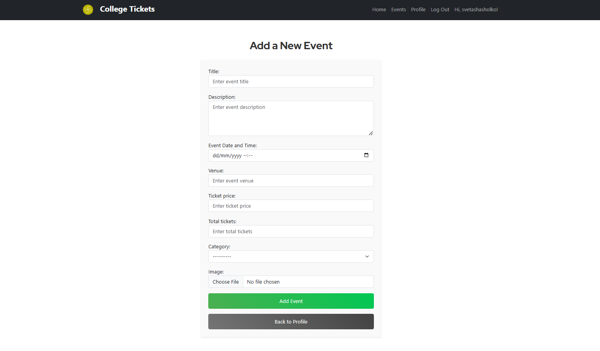
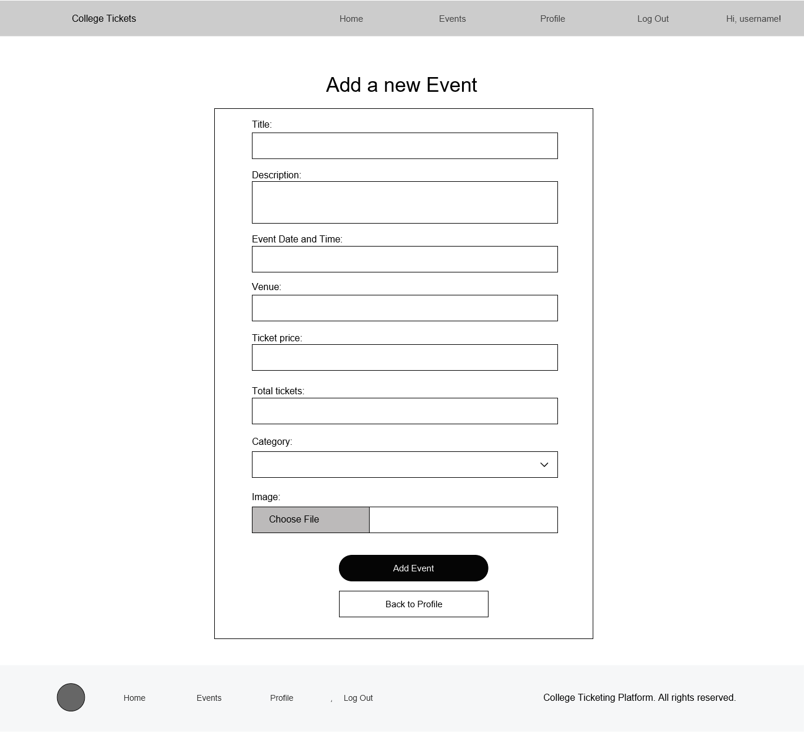

# College Event Ticketing Platform

## ✨ Introduction
The **College Event Ticketing Platform** is a fun and easy-to-use website for students and event organizers. It helps people create and manage events, buy tickets securely, and keep track of their bookings. With a colorful, responsive design, it looks great on all devices. Features like QR code tickets, user profiles, and a smooth checkout process make it simple for everyone to join in and enjoy college events.

### What It Does
The **College Event Ticketing Platform** is a complete solution for students and event organizers to manage, discover, and purchase tickets for college events. This platform offers an intuitive user experience with a seamless ticket booking process and provides QR code-based tickets for easy entry.

### Why You'll Love It
- **User-Friendly**: An attractive, responsive design built with Bootstrap that adapts perfectly on all devices.
- **Secure Payments**: Integration with Stripe for easy and secure ticket purchases.
- **Convenient Ticket Management**: Users receive email confirmations with QR codes for purchased tickets.
- **Comprehensive Profile Management**: Keep track of created events and purchased tickets in one place.

### Who It's For
- **Event Organizers**: Create and manage events, track ticket sales, and edit event details.
- **Students**: Discover upcoming events, purchase tickets easily, and keep track of bookings.

## 🎨 Style
### Color Scheme
The platform features a vibrant, modern color scheme aimed at a teenage and college student audience. The primary colors include shades of blue, green, and purple, with colorful gradient buttons to create an engaging and lively experience.

### Styling Framework
We used Bootstrap for a consistent, responsive layout across all devices. Custom CSS has been added for unique elements like gradient buttons, a fixed footer, and a styled navbar.

## 🚀 Features
This project comes with features thoughtfully crafted for college students. Everything is designed to make exploring events, managing tickets, and staying updated easy and enjoyable.

### 🏠 Home Page
The home page is designed with a vibrant, student-friendly style that immediately grabs attention and sets the tone for the platform. Here’s what it offers:

- **Colorful Banner Image**: A large, dynamic image at the top of the page creates an energetic and welcoming vibe, perfect for a student audience.
- **Upcoming Events Preview**: The 6 soonest events are displayed in an easy-to-scan card layout, each showing key details like title, date, and a short description.
- **Call-to-Action Button**: A bold gradient-styled button stands out, encouraging users to explore all events and discover more.
- **Responsive Design**: The layout adapts fluidly to various screen sizes, ensuring a smooth experience on any device.

|Screenshot |  Wireframe |
|--|--|
|    |  |

### 🗓️ Upcoming Events Page
The Upcoming Events page provides a comprehensive list of all future events in an organized and visually engaging layout. It’s designed to help users easily discover and explore events that interest them. Here's what it includes:

- **Event Cards**: Events are presented in vertically aligned cards, each showcasing an image, title, date, description, and a “View Details” button. To keep the design lively, the "View Details" buttons have randomly assigned colors, adding a fun and dynamic touch to the page.
- **Filter by Category**: Users can narrow down their search by selecting specific categories like Music, Sports, Education, and more.
- **Search Functionality**: A search bar allows users to find events by typing in relevant keywords.
- **Adaptive Layout**: Built with Bootstrap’s responsive grid system, the page looks great and works seamlessly across all device types.

|Screenshot |  Wireframe |
|--|--|
|   | |

### 📅 Event Detail Page
The Event Detail page gives users all the important information about a specific event in one place, presented in a simple and visually appealing way.

- **Large Banner Image**: A striking banner image at the top sets the tone for the event, with the event title overlay adding a professional and polished touch.
- **Details Section**: This section provides all the key information about the event, including:
    - Date and Time
    - Venue
    - Description
    - Ticket Price
- **Ticket Availability**: Users can see real-time updates on the number of tickets remaining. If the event is sold out, a bold red "SOLD OUT" message is prominently displayed, ensuring clarity.
- **Purchase Button**: A vibrant gradient button lets users easily purchase tickets or book a spot for free events.

|Screenshot |  Wireframe |
|--|--|
|   | |

### 🛒 Ticket Purchase Page
The Ticket Purchase page features a sleek, user-friendly form for selecting ticket quantity and completing the payment process using Stripe.

- **Dynamic Quantity Selector**: Users can adjust the number of tickets, and the total price updates automatically.
- **Billing Details Form**: Pre-filled with the logged-in user’s name and email for convenience.
- **Stripe Integration**: A secure Stripe form allows users to enter their payment details.
- **Responsive Design**: The form adapts well to different screen sizes for a consistent experience.
- **Payment Confirmation**: Upon successful payment, users are redirected to a success page.

|Screenshot |  Wireframe |
|--|--|
|   | |

### 👤 Profile Page
The Profile page provides a personalized experience, displaying user information and an overview of the user’s activities on the platform. It includes two main sections: Created Events and Purchased Tickets.

#### Created Events Block
Organizers can view their created events with options to edit, delete, or view detailed stats about each event.

- **Upcoming Events**: Displays a list of upcoming events created by the user. Includes an "Edit" and "Delete" button for each event.
- **Past Events**: Lists past events with ticket sales stats.
- **Add New Event Button**: A colorful button allows users to quickly add a new event.

#### Purchased Tickets Block
Displays all the tickets purchased by the user with key details such as event title, date, time, quantity, and a QR code for ticket validation.

- **Event Details**: Lists the event title, date, and ticket quantity.
- **QR Code Display**: Shows a QR code for each purchased ticket, which can be clicked to view in full size.
- **Adaptive Layout**: Uses a two-column layout on larger screens for a clear and organized view.

|Screenshot |  Wireframe |
|--|--|
|   
 | |

### ✏️ Add / Edit / Delete Event Pages
These pages allow users to manage events easily through intuitive forms styled in line with the rest of the platform.

- **Add Event**: A form to input event details like title, date, venue, description, ticket price, and an image upload option.
- **Edit Event**: Pre-populated with the current event details, making it easy for users to update any information.
- **Delete Event**: A confirmation page to prevent accidental deletions with a notification message upon successful deletion.

|Screenshot |  Wireframe |
|--|--|
|Add event|--|
|   | |
|Edit event|--|
|   | |
|Delete event|--|
|   | |

